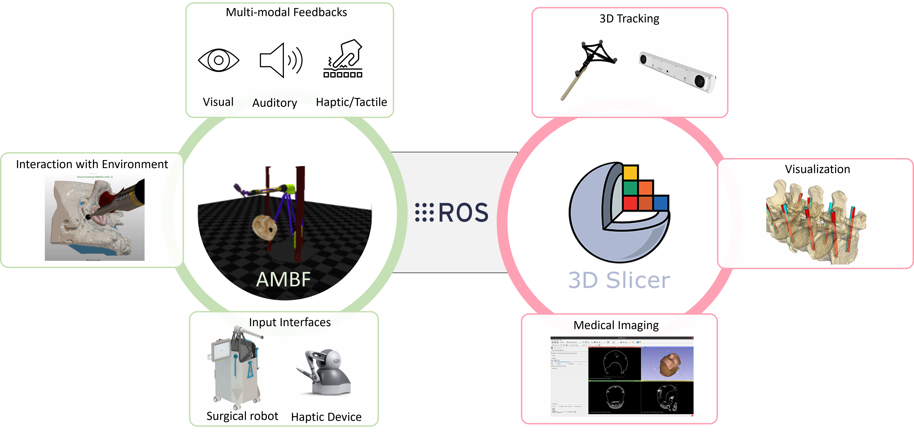

<!---
# [ENTRI: Enhanced Navigational Toolkit for Robotic Interventions](https://arxiv.org/abs/2401.11715)
-->   

<div align="center">

<samp>

<h2> Enhanced Navigational Toolkit for Robotic Interventions </h2>

<h3> Manish Sahu, Hisashi Ishida, Laura Connolly, Hongyi Fan, Anton Deguet, Peter Kazanzides, Francis X. Creighton, Russell H. Taylor, Adnan Munawar </h3>

</samp>   

   
| **[ [```arXiv```](<https://arxiv.org/abs/2401.11715>) ]** |
|:-------------------:|

<!---
IEEE 2024, Transactions on Medical Robotics and Bionics (TMRB)
-->    

</div>

If you find this repository or paper useful, please cite:

```bibtex
@article{sahu2024entri,
  title={Enhanced Navigational Toolkit for Robotic Interventions},
  author={Sahu, Manish and Ishida, Hisashi and Connolly, Laura and Fan, Hongyi and Deguet, Anton and Kazanzides, Peter and Creighton, Francis X and Taylor, Russell H and Munawar, Adnan},
  journal={arXiv preprint arXiv:2401.11715},
  year={2024}
}
```
    
---

## Abstract

<p align="center">

</p>

Image-guided robotic interventions represent a transformative frontier in surgery, blending advanced imaging and robotics for improved precision and outcomes. This paper addresses the critical need for integrating open-source platforms to enhance situational awareness in image-guided robotic research. We present an open-source toolkit, named ENTRI, that seamlessly combines a physics-based constraint formulation framework, AMBF, with a state-of-the-art imaging platform application, 3D Slicer. ENTRI facilitates the creation of highly customizable interactive digital twins, that incorporate processing and visualization of medical imaging, robot kinematics, and scene dynamics for real-time robot control. Through a feasibility study, we showcase real-time synchronization of a physical robotic interventional environment in both 3D Slicer and AMBF, highlighting low-latency updates and improved visualization.


## Installation

See [INSTALLATION.md](INSTALLATION.md) file.